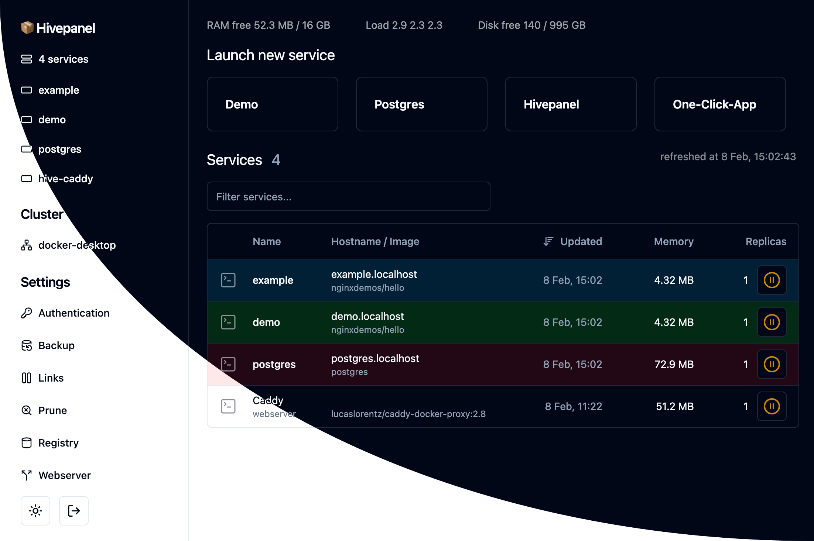

# 📦 Hivepanel

Docker Swarm UI for self hosting.

Goals:

- Build a community and clearly communicate goals and roadmap
- Keep it simple, keep it lean and mean
- Modern UX that caters to both beginners and experts
- Accessible navigation, each screen must have a URL
- API-first, every feature must be easy to control via API
- Specification-first, every feature must have an intended way of working
- Expose the full power of Docker Swarm if needed
- Zero downtime deployments
- Installation should not affect the existing cluster
- Support for alternative web servers: Traefik, Caddy, Nginx
- Focus on single VPS usage, only consider cluster support if contributors use it themselves
- Features must undergo automated testing before every release
- Consider project sustainability from the start

The prototype contains these features:

- [x] Traefik web server
- [x] Manage memory limits
- [x] Manage labels
- [x] Start/stop/scale services with one click
- [x] Edit service spec
- [x] Detect failing services
- [ ] Wildcard certificate generation
- [x] Environment variable editing
- [ ] Hover over system info to see live stats

Up for discussion:

- What is a good default for automatically cleaning up disk space? Decide based on free disk space after every build?
- How to build adapters for alternative webservers like caddy, nginx, ...
- Should most logic run on the server or on the client?
- Operation queuing system: multiple deploys should be queued one after the other
- All config in service labels (like traefik), does that make sense or is it unpractical?
- Mount /etc/ufw and integrate ufw support?
- Would a built-in share functionality for services/stacks improve community collaboration?
- How to make swarm join/leave easier?
- How to handle multi-server deployments? Should the hivepanel container run on all nodes?
- Is it useful to give a name to each node in the cluster?
- Import/export services as .zip that includes the mounted volumes
- Authenticate using WebAuthn
- If it were easer to setup a registry of service templates (like builtin) would more people contribute?
- If people could like/comment on templates, would more people contribute?
- How to make the project sustainable?
  - Use commonly used technologies
  - Build on top of stable tech
  - Push contributor information inside panel?
  - Pay for support?
- Which npx commands should be available?
  - start: local or immediately in swarm?
  - upgrade: pull latest docker image and restart service
- Show available docker tags to make it easy to upgrade a service

Alternatives:

- Caprover
- Coolify
- Easypanel
- Portainer
- Rancher
- [Shipyard](https://shipyard-project.com/)
- Swarmpit
- Swirl
- Traefik Pilot
- UCP
